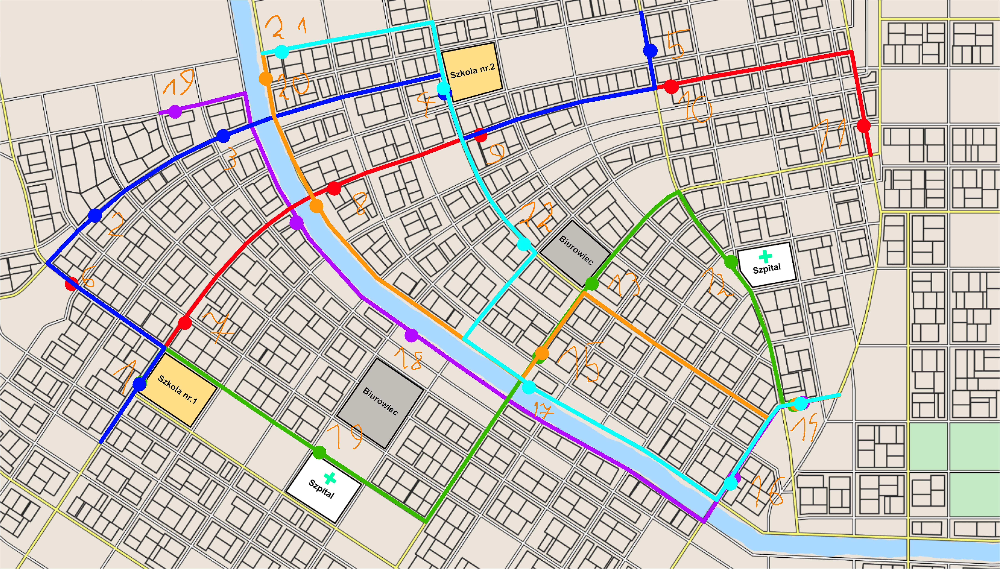

 

# Przystanki

1. Koło szkoły nr 1
    - atrakcyjny około ~8 i ~14
2. .
3. .
4. Koło szkoły nr 2
    - atrakcyjny około ~8 i ~14
5. .
6. .
7. Koło szkoły nr 1
    - atrakcyjny około ~8 i ~14
8. .
9. .
10. .
11. .
12. Koło szpitala
    - atrakcyjny cały dzień
13. Koło biurowca
    - atrakcyjny koło ~8 i ~17
14. .
15. .
16. .
17. .
18. Koło biurowca
    - atrakcyjny koło ~8 i ~17
19. Koło biurowca
    - atrakcyjny koło ~8 i ~17
20. .
21. .
22. Koło biurowca
    - atrakcyjny koło ~8 i ~17

# Linie

## 1 Niebieska
**Dla każdej godziny od 7 do 22:**
1. 00 -> przystanek 1
1. 05 -> przystanek 2
1. 11 -> przystanek 3
1. 18 -> przystanek 4
1. 25 -> przystanek 5
1. 31 -> przystanek 4
1. 36 -> przystanek 3
1. 41 -> przystanek 2
1. 47 -> przystanek 1
*z możliwym opóźnieniem*
## 2 Czerwona
**Dla każdej godziny od 7 do 22:**
1. 00 -> przystanek 5
1. 04 -> przystanek 7
1. 09 -> przystanek 8
1. 13 -> przystanek 9
1. 18 -> przystanek 10
1. 21 -> przystanek 11
1. 27 -> przystanek 10
1. 32 -> przystanek 9
1. 38 -> przystanek 8
1. 41 -> przystanek 7
1. 48 -> przystanek 5
*z możliwym opóźnieniem*
## 3 Flioletowa
**Dla każdej godziny od 7 do 22:**
1. 00 -> przystanek 19
1. 12 -> przystanek 18
1. 26 -> przystanek 16
1. 31 -> przystanek 14
1. 36 -> przystanek 16
1. 46 -> przystanek 18
1. 58 -> przystanek 19
*z możliwym opóźnieniem*
## 4 Zielona
**Dla każdej godziny od 7 do 22:**
1. 00 -> przystanek 1
1. 05 -> przystanek 19
1. 09 -> przystanek 15
1. 14 -> przystanek 13
1. 20 -> przystanek 12
1. 26 -> przystanek 14
1. 31 -> przystanek 12
1. 38 -> przystanek 13
1. 42 -> przystanek 15
1. 48 -> przystanek 19
1. 54 -> przystanek 1
*z możliwym opóźnieniem*
## 5 Pomarańczowa
**Dla każdej godziny od 7 do 22:**
1. 00 -> przystanek 20
1. 08 -> przystanek 8
1. 18 -> przystanek 15
1. 27 -> przystanek 14
1. 37 -> przystanek 15
1. 46 -> przystanek 8
1. 54 -> przystanek 20
*z możliwym opóźnieniem*
## 6 Cyanowa
**Dla każdej godziny od 7 do 22:**
1. 00 -> przystanek 21
1. 06 -> przystanek 4
1. 11 -> przystanek 12
1. 14 -> przystanek 17
1. 21 -> przystanek 16
1. 24 -> przystanek 14
1. 32 -> przystanek 16
1. 36 -> przystanek 17
1. 41 -> przystanek 12
1. 45 -> przystanek 4
1. 52 -> przystanek 21
*z możliwym opóźnieniem*
